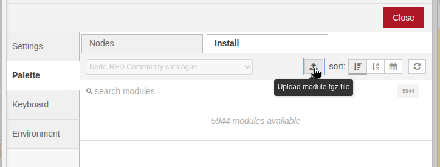
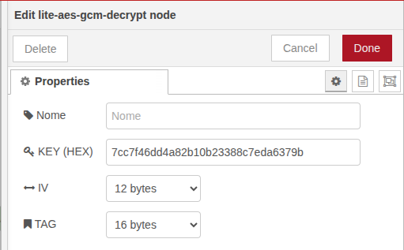
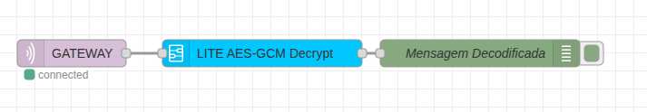

# ESPEncrypt

### Biblioteca de Criptografia AES-GCM para ESP32 e integração com Node-RED

   

Por enquanto, o projeto se limita à criptografia AES-GCM (_Advanced Encryption Standard - Galois/Counter Mode_), que utiliza uma chave (128 _bits_), um vetor de inicialização (IV/Nonce de 96 _bits_) e uma tag de autenticação de dados (128 _bits_).

A criptografia dos dados é realizada através dos recursos da [API MbedTLS](https://github.com/espressif/esp-idf/blob/master/components/mbedtls/port/include/mbedtls/esp_config.h) da Espressif.

## Instalação

### Arduino IDE

1. Baixe o `.zip`
2. Extraia o `.zip` no diretório de bibliotecas da Arduino IDE (Ex: `C:\Usuários\usuario\Documentos\Arduino\libraries`) OU inclua o `.zip` utilizando o menu `Sketch > Incluir Biblioteca > Adicionar Biblioteca .zip` da Arduino IDE.

### Node-RED

#### Windows & Linux

1. Vá na configuração de Paletas: `Menu > Manage Palette`;
2. Clique na seção `Install`;
3. Importe o arquivo `node-red-contrib-esp32encrypt-1.0.2.tgz`.

<p align="center">
  
</p>

#### Linux (NPM)

Caso esteja utilizando algum sistema Linux, o seguinte procedimento também funciona:

1. Abra o terminal na pasta que contém os arquivos da biblioteca
2. Instale o nó através do comando:

    ```bash
    npm install ./node-red-contrib-esp32encrypt-1.0.2.tgz
    ```
3. Para desinstalar o nó, utilize o comando: ```npm uninstall node-red-contrib-esp32encrypt```.


## Utilização

### Criptografia no ESP32 (Arduino IDE)

Acesse o código de exemplo [disponível aqui](examples/Encrypt/Encrypt.ino).

Basta seguir o passo a passo:

1. Inclua a biblioteca `ESPEncrypt.h`:
    ```Arduino
    #include "ESPEncrypt.h"
    ```
2. Defina a chave criptográfica AES em hexadecimal (_precisa conter 32 caracteres_) `AES_KEY` e o objeto para implementação da criptografia `crypto` conforme segue a seguir:
    ```Arduino
    #define AES_KEY "7cc7f46dd4a82b10b23388c7eda6379b"
    ESPEncrypt crypto(AES_KEY);
    ```
3. Utilize o método `crypto.encryptString()` para criptografar uma String qualquer:

    ```Arduino
    String msg = "Hello World";
    String cipher = crypto.encryptString(msg);
    ```
4. Publique no broker MQTT a String `cipher`.

### Decodificação no Node-RED

1. Adicione o nó `lite-aes-gcm-decrypt` ao fluxo;
2. Entre nas configurações do nó: por padrão, deixe `IV` em 12 bytes e `TAG` em 16 bytes. Configure a chave `KEY` **com a mesma chave do código `.ino`**;
3. Ligue a saída do nó MQTT na entrada do nó de decodificação (`lite-aes-gcm-decrypt`);

<p align="center">
  
</p>

4. Utilize o `msg.payload` (saída decodificada).

<p align="center">
  
</p>